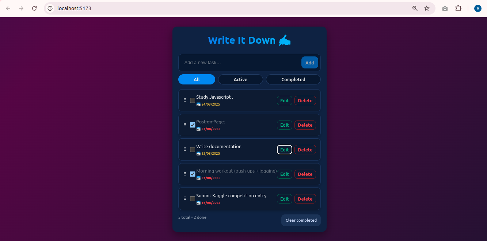

# 📝 To-Do List (React + JavaScript)

A beginner-friendly **To-Do List Application** built using **React.js** and **JavaScript**.  
This project helps you manage daily tasks with ease, while also serving as a practice project to learn React concepts like components, props, and state management.

🌐 **Live Demo:** [Try it here!](https://to-do-list-react-js-three.vercel.app/)

---

## 🚀 Problem Statement
Managing daily tasks can sometimes feel overwhelming. Sticky notes and scattered reminders often lead to forgetting important to-dos.  
This project aims to provide a **simple, beginner-level digital solution** to keep track of your tasks in one place.  

---

## ✅ Features (Current Version)
- ➕ **Add new tasks** instantly.  
- ✔️ **Mark tasks as completed**.  
- 🗑️ **Delete tasks** when no longer needed.  
- 🎙️ **Add tasks by speech** (Voice recognition feature).  
- ⏰ **Optional time field** while adding tasks.  
- 📱 **Responsive UI** (mobile-friendly).  
- 🌍 **Free to use & open-source**.

---

## 🔮 Future Enhancements
Planned features to make the app more powerful & engaging:  

- 📅 **Due date + calendar view** (monthly calendar with highlighted tasks).  
- 📊 **Progress bar** (e.g., “5/10 tasks done today”).  
- 🎨 **Priority levels** (High/Medium/Low with color tags).  
- 🎉 **Animations** (task completion = confetti / particle burst).  

- ⏳ **Pomodoro timer** (25min focus + 5min break).  
- ⏱️ **Stopwatch mode** to track work time.  
- 🔔 **Notifications / reminders** for upcoming deadlines.  
- 🔥 **Streaks** (don’t miss a day, keep momentum).  

---

## 🛠️ Tech Stack
- **React.js** (Frontend framework)  
- **JavaScript (ES6+)**  
- **CSS3** for styling  
- **Vercel** for deployment  

---

## 🤝 Contribution
This is a beginner project and open for contributions. Feel free to fork, suggest improvements, or implement new features.

---

## 📜 License
This project is free to use under the **MIT License**.

## 📸 Screenshot  

